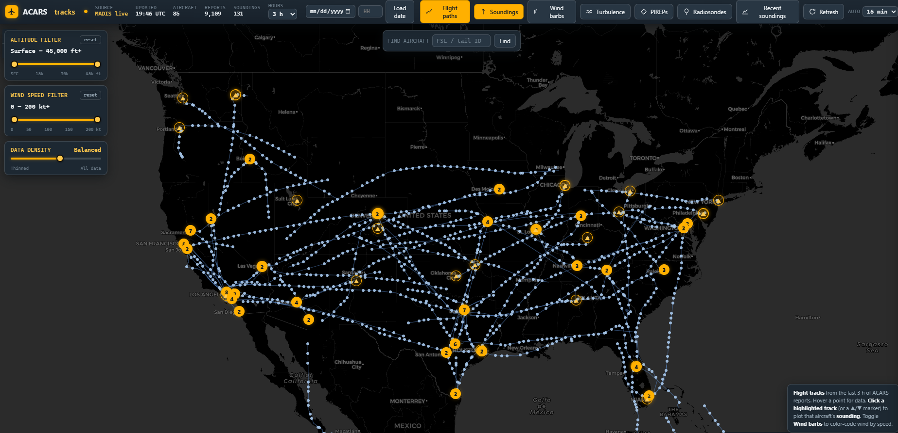
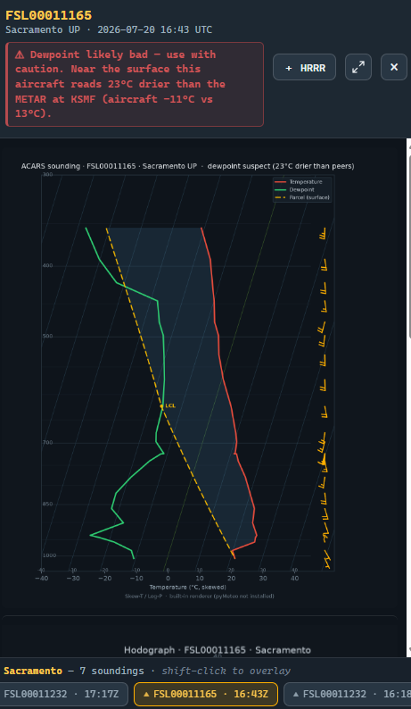

# How to put this on GitHub

*(This file is for you, not for users. Delete it before publishing if you like.)*

---

## Step 1 — Fill in the blanks (5 minutes)

Search these files for `<YOUR NAME>` and `<YOUR EMAIL>` and replace them:

- `LICENSE` — the copyright line
- `CAPABILITIES.md` — the contact line at the bottom

That's it. Nothing else has a placeholder.

## Step 2 — Decide public or private

**Private** is the right call while you're pitching. You can invite specific people
by GitHub username or email (Settings → Collaborators). They get the whole repo,
they can read every line, and nothing is public until you decide.

**Public** later, if you want it findable, or if you go the itch.io / free-tool
route.

You can flip private → public at any time. Not easily the other way, so start
private.

## Step 3 — Create the repository

Easiest path if you've never used git:

1. Install **GitHub Desktop** — <https://desktop.github.com> (free, no command line).
2. Sign in / create a free GitHub account.
3. **File → Add Local Repository** → choose this folder.
4. It'll say "this isn't a git repository — create one?" → **Yes**.
5. Name it something like `acars-tracks`. Set it **Private**.
6. It will list the files it's about to add. The `.gitignore` already excludes the
   cache, the `.venv`, and build output, so you should see roughly 25 source files
   plus `static/`. If you see hundreds of files, stop — the `.gitignore` isn't
   being picked up.
7. Write "Initial commit" in the summary box → **Commit to main** →
   **Publish repository**.

Done. You now have a link.

## Step 3b — Or upload through the website (no software to install)

If you'd rather not install GitHub Desktop:

1. Create the repository on github.com (**+** → **New repository**), set it
   **Private**, and tick "Add a README" so it isn't empty.
2. On the repo page: **Add file** → **Upload files**.
3. Extract `acars_tracks.zip` on your PC. Open the extracted folder.
4. Select **everything inside it** (Ctrl+A) — including the `static` and `docs`
   folders — and drag it all onto the upload page. GitHub keeps the folder
   structure.
5. Scroll down, write a message, **Commit changes**.

> **Do not upload the ZIP file itself.** This is the most common mistake, and it
> quietly defeats the purpose:
>
> - **The source stops being readable.** A GitHub repo's whole value for an
>   engineer at Collins or NWS is that they can click any file and read it in the
>   browser. A ZIP is an opaque blob — they'd have to download and unpack it,
>   which is exactly the friction you're trying to remove.
> - **The README's links break.** It links to `GETTING-STARTED.md`,
>   `DATA-AND-LICENSING.md`, and `DISTRIBUTING.md`. If those are inside a ZIP,
>   every one of those links 404s.
> - **Step 1 of your own instructions stops making sense.** The README tells people
>   to click "Code → Download ZIP" — if the repo *contains* a ZIP, they get a ZIP
>   inside a ZIP and have to unpack twice.
>
> Upload the *contents*, not the container. GitHub makes the ZIP for you, on
> demand, from whatever is in the repo — that's what the green Code button does.

> **Can't see `.gitignore` when selecting files?** Windows hides files that start
> with a dot. In File Explorer: **View** → **Show** → **Hidden items**. It's not
> fatal if you miss it — it only matters for future contributors — but it's tidier
> to include.

A repo with no pictures reads as abandoned. A repo with three good screenshots
reads as a real tool.

1. Make a folder `docs/screenshots/`.
2. Drop in 3–4 PNGs. Suggested, in order of persuasiveness:
   - The map with tracks + wind barbs over the CONUS
   - A Skew-T with the **red "Dewpoint likely bad"** banner (this is your headline)
   - The comparison viewer with AMDAR + radiosonde + HRRR overlaid
   - The console showing the faulty-sensor list
3. Add them near the top of `README.md`:
   ```markdown
   
   
   ```
4. Commit + push in GitHub Desktop.

## Step 4 — Add screenshots (worth the 10 minutes)

See the screenshot notes in `docs/screenshots/README.txt`.

## Step 5 — Publish a downloadable build (optional)

For people who won't install Python:

1. Run `Build-ACARS-EXE.bat` on your Windows machine.
2. Zip the resulting `dist\ACARS-Tracks` folder.
3. On GitHub: **Releases → Create a new release** → tag `v1.0` → attach the zip.

Now there's a download link. **Never email the .exe** — corporate mail gateways
drop executable attachments, and Collins/NWS/airline gateways certainly will. A
link is the only thing that gets through.

---

## What to send people

Keep the email short. The repo does the work.

> Subject: Aircraft moisture-sensor QC tool — a gap in MADIS QC
>
> [Name],
>
> I'm a retired NWS forecaster. I rebuilt the old GSD/FSL ACARS display as a
> desktop tool, and in the process found something I think you'll want to know
> about: MADIS quality-controls aircraft dewpoint only to QC level 2 — there's no
> spatial consistency check on moisture. An airframe with a failed humidity sensor
> reports plausible, internally-consistent, bone-dry values that pass QC
> indefinitely. Some have been doing it for years.
>
> The tool does the missing check — against the airport's own METAR — and names
> the offending tails.
>
> Source and a one-page summary: [link]
> Happy to demo it live if it's of interest.
>
> [Your name]

Point them at **`CAPABILITIES.md`** — that's the one-pager, and it leads with the
QC gap rather than the display.

If they're going to *run* it, point them at **`GETTING-STARTED.md`** as well. Your
audience are meteorologists, not developers: the green "Code → Download ZIP" button
is not obvious to anyone who hasn't used GitHub, and that guide walks through it,
the Python install, and every snag, one step at a time.

## Tailoring per audience

- **Airline friends** — lead with *maintenance*: "tail X has a contaminated
  humidity element." It's their hardware and they can act on it today. Easiest
  conversation you'll have; start here.
- **NWS / MADIS** — lead with the *ingest blind spot*: bad moisture obs are going
  into operational models.
- **Collins** — lead with *fleet sensor-health monitoring* from data already being
  collected. Closest to a product.

## One thing to be ready for

Someone technical will ask why this isn't a website. The answer is in
`DATA-AND-LICENSING.md`: real-time ACARS/AMDAR is restricted for 48 hours, so a
public site would be redistribution. Distributing the app isn't — each user
fetches their own data. Knowing that cold is a credibility marker; it says you
understand the data politics, not just the meteorology.
