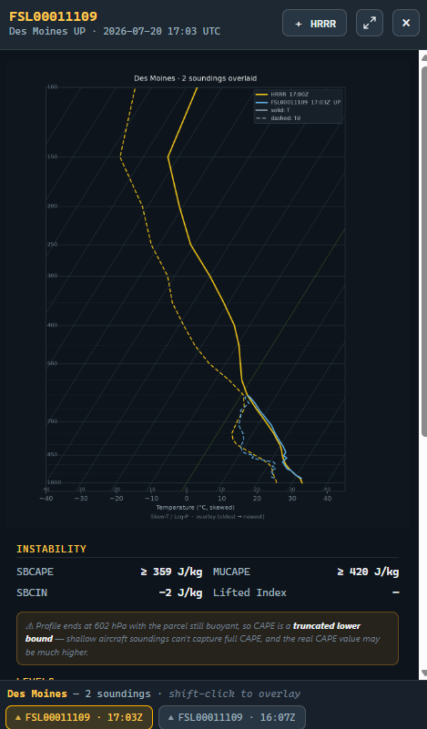
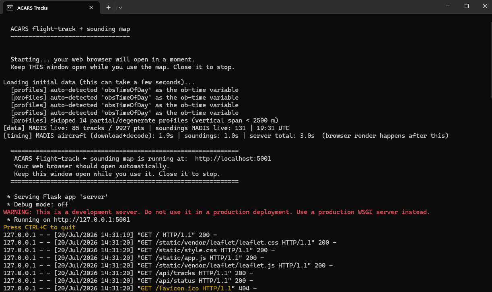

# ACARS Flight Tracks, Wind Barbs & Soundings

## Screenshots




 


### ▶ Never run something from GitHub before? → **[GETTING-STARTED.md](GETTING-STARTED.md)**
*Step by step, written for meteorologists rather than programmers.*

## Run it in three steps

1. Click the green **`< > Code`** button near the top of this page → **Download ZIP**
2. Right-click the downloaded ZIP → **Extract All** — *don't run it from inside the ZIP*
3. Double-click **`Start ACARS Tracks.bat`**

That's it. The first run takes a few minutes to set itself up (and will tell you if
you need to install Python first); every run after that starts in about ten
seconds. Your browser opens to the map on its own.

**No internet?** Double-click `Start ACARS Tracks (offline demo).bat` for a
sample-data tour.

*Stuck? Every common snag is in
[GETTING-STARTED.md](GETTING-STARTED.md#if-something-goes-wrong).*

---

> **Other docs:** **[CAPABILITIES.md](CAPABILITIES.md)** is the one-page summary,
> including the aircraft moisture-sensor QC gap this tool was built to expose.
> **[DATA-AND-LICENSING.md](DATA-AND-LICENSING.md)** covers data sources and the
> 48-hour ACARS restriction. **[DISTRIBUTING.md](DISTRIBUTING.md)** covers building
> a standalone Windows app and notes for an IT/security review.
>
> *Screenshots: add yours to `docs/screenshots/` — see HOW-TO-PUBLISH.md.*

---

## What it does

An interactive map of recent aircraft weather reports from the NOAA MADIS **ACARS
en-route** feed. It connects the reports from each aircraft into a **flight
track**, lets you **hover any point** to read the data, has a **Wind barbs**
button that draws proper wind barbs **color-coded by wind speed in knots**, and a
**Turbulence** button that plots aircraft **EDR turbulence reports** colored by
severity, and a **PIREPs** button that overlays live **pilot reports** color-coded
for turbulence, icing, or smooth air.

Aircraft that climbed or descended recently also have a **vertical profile**
(sounding) in the MADIS **ACARS profiles** feed. Those tracks are **highlighted**;
**click one** (or its ▲/▼ marker) and the page plots that aircraft's
**Skew-T/Log-P sounding**, rendered with **pyMeteo**. A **Radiosondes** button
adds the weather-balloon launch sites too, so you can pull up the **latest 00Z/12Z
radiosonde** for any station and compare it, side by side, with a nearby aircraft
sounding in the identical Skew-T / hodograph / analysis view. A **＋ HRRR** button
inside the sounding panel goes one step further and overlays the **HRRR model
forecast** sounding for that same time and place, so you can compare the planes
against the model.

It downloads the **last few hours** of data (you choose how many, 1–12),
runs a tiny web server on your own PC, and opens the map in your browser.
Nothing is uploaded anywhere — the only internet traffic is your computer asking
NOAA (and, for radiosondes, the Iowa Environmental Mesonet) for the data files.

---

## What you need (one-time setup)

> **Just want to start it with one click — or share it with someone?**
> See **`DISTRIBUTING.md`**. On Windows you can simply double-click
> **`Start ACARS Tracks.bat`** (it sets everything up for you), or build a
> standalone **`.exe`** that runs on PCs without Python. The steps below are the
> manual way.

1. **Install Python 3** (if you haven't already) from https://www.python.org/downloads/ .
   On the first screen of the installer, tick **"Add python.exe to PATH"**, then
   click Install.

2. **Put this folder somewhere easy**, e.g. your Desktop.

3. **Open a terminal in this folder.** In File Explorer, open the folder, then
   **right-click an empty area → "Open in Terminal"** (on Windows 11). A black or
   blue window appears.

4. **Install the building blocks.** In that window, type this and press Enter:

   ```
   pip install -r requirements.txt
   ```

   Let it finish (it downloads a few small libraries). For the nicer pyMeteo
   sounding renderer, you can also run `pip install -r requirements-optional.txt`
   — it's optional; without it the app uses a clean built-in renderer.

---

## Run it

### See it right now, with no internet needed (demo data)

```
python server.py --demo
```

Your browser opens with ~120 made-up flights so you can try everything offline.

### Use the real last-6-hours data

```
python server.py
```

It downloads the latest ACARS files, builds the flight tracks, and opens the map.
The first download can take a few seconds.

When you're done, click back on the terminal window and press **Ctrl + C** to stop.

### Look at a past day (historical archive)

NOAA keeps an archive of older files, so you can look at any date — not just the
last few hours. Two ways:

- **In the app:** use the **date box** at the top, pick a day (and optionally an
  end **hour** in UTC, 0–23), and click **Load date**. The map fills with that
  day's flights and soundings. Click **Live** to go back to the latest data. (The
  hour is the *end* of the window; with the default 3-hour window, hour `18` shows
  12Z–18Z that day. Leave the hour blank for the end of the day.)
- **From the command line:**

  ```
  python server.py --date 2026-06-10            (ends at 23Z, last 3 hours of the day)
  python server.py --date 2026-06-10 --hour 18  (the 3 hours ending 18Z)
  python server.py --date 2026-06-10 --hour 18 --hours 3
  ```

Times are **UTC**. The date picker lets you go back **up to 10 years**; how far
you can actually load depends on what NOAA keeps in the MADIS archive for that
day. Very recent days may take a little while to appear in the archive.

---

## Using the map

- **Flight tracks** — each thin blue line is one aircraft's path over the last
  3 hours, built from its individual reports.
- **Hover a dot** — a little panel shows the aircraft id, time (UTC), altitude
  (flight level + feet), temperature, and wind (direction @ speed in knots).
- **Highlighted (brighter, thicker) tracks have a sounding.** A marker sits at the
  airport: a **▲/▼** for a single sounding (▲ = departure/"UP", ▼ = arrival/"DOWN"),
  or a **number** when an airport has several. **Click the track, a dot on it, or
  the marker** to open a **Skew-T sounding** in a panel on the right. When an
  airport has more than one, a **row of tabs** appears below the plot — click a tab
  to flip between all the soundings there (a busy field often has half a dozen or
  more), or **shift-click several tabs to overlay them** on one plot and compare how
  the atmosphere changed over time. Clicking a track with no profile just tells you
  none is available.
- **Window dropdown** (top bar, next to "window") — pick how many **hours of
  history** to show, from **1 to 12** (default 6). Changing it reloads the data
  for the new time span. A shorter window is less cluttered and loads faster; a
  longer one shows more complete flight tracks. It applies to the live feed and,
  when you've loaded an archive date, to that too.
- **Flight paths button** (top right) — shows/hides the **lines** connecting each
  aircraft's reports. Turn them off to **declutter when you're studying wind
  barbs**; the data points themselves stay put, so you still see where the
  reports are — you just lose the lines between them. On by default.
- **Soundings button** (top right) — shows/hides the ▲/▼ sounding markers.
- **Wind barbs button** (top right) — turns on wind barbs at the reports,
  **color-coded by wind speed in knots** (see the legend, bottom-left). A barb's
  staff points the way the wind is coming **from**; short line = 5 kt, long line
  = 10 kt, solid triangle = 50 kt.
- **Turbulence button** (top right) — overlays **EDR turbulence reports** straight
  from the aircraft. Each report that carries turbulence data is drawn as a dot
  **colored and sized by severity** (see the key, bottom-left): teal = smooth,
  yellow = light, orange = moderate, red = severe, magenta = extreme; bigger dot =
  rougher air. Hover any dot for the exact value, the aircraft, and the flight
  level. The number plotted is the **maximum eddy dissipation rate (EDR)** — the
  ICAO-standard, aircraft-independent turbulence metric (cube-root form, m^(2/3)/s),
  proportional to the bumpiness the aircraft actually felt. It honors the
  **altitude filter**, so you can isolate turbulence in a given layer. Two things
  to keep in mind: (1) **coverage is sparse** — only part of the fleet reports EDR
  (mostly certain US carriers), so you'll see a scattering of reports, not a dense
  field; and (2) unlike a contoured analysis, **these are the raw point reports
  with no interpolation**, so empty space just means "no report there," never a
  guess. Severity bands used: light ≥ 0.10, moderate ≥ 0.20, severe ≥ 0.40,
  extreme ≥ 0.60.
- **PIREPs button** (top right) — overlays recent **pilot reports (PIREPs/AIREPs)**
  as **diamonds color-coded by what was reported**: amber = turbulence, blue =
  icing, purple = both, green = smooth / "negative" (a pilot explicitly reporting
  no hazard), gray = other (a position/wind/temp report with no turb or icing).
  The diamond grows with intensity (light → severe). Hover any one for the decoded
  report — turbulence and icing intensity, flight level, aircraft type, time, and
  the raw coded text. These are **real pilot observations, live from the NOAA/NWS
  Aviation Weather Center** (updated every minute), so unlike the EDR archive this
  is genuinely current — but it's pilot-*subjective* intensity, not the objective
  EDR number, and it's sparse (only reports that pilots actually filed). It loads
  when you turn it on and refreshes with the data; in archive mode it requests
  reports for the date you're viewing (the AWC keeps roughly the last 15 days).
  Coverage is the CONUS region (the AWC PIREP feed requires a bounding box; this
  one spans roughly 20–55°N, 130–60°W).
- **Radiosondes button** (top right) — shows the **weather-balloon (radiosonde)
  launch sites** as **cyan pills** labeled with each station's three-letter code
  (e.g. `GRB` for Green Bay, `OUN` for Norman). **Click a balloon** and the page
  fetches that station's **latest sounding** and draws it in the very same
  Skew-T / hodograph / analysis panel as the aircraft soundings — so you can put
  an ACARS profile and the radiosonde side by side and compare them directly.
  Radiosondes are launched **twice a day, at 00Z and 12Z**, and the app
  automatically pulls the most recent one available (it falls back to the
  previous launch if the newest isn't posted yet). Unlike aircraft, a balloon
  climbs all the way into the stratosphere, so a radiosonde plot runs up to
  **100 hPa** (the aircraft soundings stop at 300 hPa). **U.S. and Canada**
  stations come from the Iowa Environmental Mesonet (IEM) in near real time; in
  **archive mode** that data is fetched for the date you're viewing, so balloon
  and aircraft data stay in sync. **Stations elsewhere in the world** (De Bilt,
  Camborne, Tateno, Sydney, …) are served **freshest-first**: the app first decodes the **DWD open-data TEMP feed** (Deutscher Wetterdienst relays the worldwide GTS radiosonde stream as plain-text WMO TEMP bulletins, refreshed every ~15 minutes), so a global station shows its latest 00Z/12Z launch within hours. If DWD has nothing for that station in the recent window, it falls back to NOAA NCEI's **Integrated Global Radiosonde Archive (IGRA)** (~2-day lag) so you always get the most recent available sounding. The observation time is printed on every plot. DWD data is shown with the required **“Source: DWD”** credit and may be reused commercially with that attribution; launch with **`--no-dwd`** to use IGRA only. See
  **Comparing a radiosonde with an aircraft sounding** below.
- **Altitude filter** (top-left of the map) — a slider with **two handles, a
  minimum and a maximum**, that limits which reports are drawn to those in the
  altitude band you pick (in feet). Drag the left handle up from *Surface* and
  the right handle down from *45,000 ft* to, say, **surface–10,000 ft** to see
  only the low-level data — great for isolating boundary-layer winds, or for
  decluttering the cruise-level traffic so you can study climbs and descents.
  The flight tracks, dots, and wind barbs all honor the band; **Reset** puts it
  back to everything. (Soundings are full vertical profiles, so the airport
  markers aren't affected.) This mirrors the altitude control on the old page.
- **Wind speed filter** (just below the altitude one) — the same kind of
  two-handle slider, but for **wind speed in knots**. Drag the left handle up to
  hide the light winds and keep only the strong ones — e.g. **80 kt and up** to
  pick out **jet streaks** and the core of the jet stream. It limits the wind
  barbs and the dots to reports inside the speed band. It pairs naturally with
  the altitude filter: set the altitude to cruise levels (say 30,000–40,000 ft)
  *and* the wind to the strong end, and the jet streak stands out on its own.
  **Reset** returns to all wind speeds.
- **Data density** (third slider, a single handle) — controls how much the map
  **thins out** the plotted reports. By default the dots and wind barbs are
  thinned so a zoomed-out view stays readable, which is why not every report
  becomes a barb until you zoom in. Slide toward **All data** to plot more of
  them — handy when you want to see **detailed winds aloft** as a dense field of
  barbs — or toward **Thinned** to declutter when there are thousands of flights
  in view. (Zooming in still reveals more detail at any setting; this just sets
  how aggressive the thinning is.)
- **Zoom in** to thin things out and see more individual barbs and points; zoom
  out for the big picture.
- **Refresh button** — re-downloads the newest data immediately.
- **Auto-update** (far right, "auto") — re-downloads the latest data on a timer,
  so the map keeps itself current without you clicking anything — handy if you're
  keeping it open to watch conditions evolve. Choose **off, 15 min, 30 min, or
  1 hr** (15 min by default). New ACARS files post roughly hourly, so 15–30 min
  comfortably catches each update. (Auto-update pauses while you're viewing an
  archive date, since historical data doesn't change.)

---

## Aircraft soundings (Skew-T / Log-P)

When an aircraft climbs out of or descends into an airport, its string of reports
forms a **vertical profile** of the atmosphere — temperature, dewpoint and wind
from the ground up. NOAA publishes these in the separate **ACARS profiles** feed,
and this page turns the one you click into a **Skew-T/Log-P diagram**.

- The plot is drawn by **pyMeteo** when it's installed (the optional
  `pip install -r requirements-optional.txt`). pyMeteo is the well-known Python
  Skew-T library written by a meteorologist specifically with ACARS soundings in
  mind.
- Red line = **temperature**, green line = **dewpoint**, and the column on the
  right shows the **winds** as barbs from the surface up (handy for spotting the
  jet). Many aircraft don't carry a moisture sensor, so the dewpoint line may be
  missing — the panel says so when that happens.
- If pyMeteo isn't installed for some reason, the page automatically falls back
  to a clean **built-in** Skew-T so it still works; the footer of the panel tells
  you which renderer produced the image.
- Big airports usually have **several** profiles in the same window (different
  aircraft, departures and arrivals). They share one marker showing the count, and
  the **tabs** under the plot let you step through every sounding at that field.
- To compare them, **hold Shift and click two or more tabs**: the soundings are
  drawn **on top of each other** in different colors (temperature solid, dewpoint
  dashed), oldest → newest, with a legend. This is a quick way to see how the
  temperature and moisture changed through the morning, ahead of a front, etc.
  Shift-click an overlaid tab again to remove it; a normal click goes back to one.

- Each sounding is labeled with the **nearest city** (e.g. *Berlin*, *Fort
  Worth*), worked out from the lat/lon of its lowest observation, with the
  airport code shown in parentheses when it adds detail — so you can tell at a
  glance where each profile is from.
- Every sounding is labeled with its **time (UTC)** — on the tabs, in the overlay
  legend, and in the panel header — and **hovering an airport marker** shows the
  time span of its soundings and how long ago the most recent one was, so you can
  tell at a glance how fresh they are and how far apart in time.

### Sounding analysis (CAPE, shear, etc.)

Click a single sounding and, below the Skew-T, you get an **NSHARP-style
parameter readout** — the kind of thing the old NOAA/GSD ACARS Java page showed
next to each profile. It's grouped into:

- **Instability** — SBCAPE, MUCAPE, SBCIN, Lifted Index
- **Levels** — LCL, LFC, EL, the freezing (0 °C) level and the −20 °C level
- **Moisture & indices** — precipitable water, K index, Total Totals, the
  700–500 mb and 0–3 km lapse rates
- **Surface** — temperature, dewpoint, relative humidity
- **Wind & shear** — 0–1 km and 0–6 km bulk shear, the 0–6 km mean wind, and
  storm-relative helicity (0–1 and 0–3 km, Bunkers right-mover)

On the plot itself, the **surface parcel** is drawn as a yellow dashed line with
the **CAPE area shaded red** (and the negative/CIN area blue), and the **LCL,
LFC, and EL** are marked. A few notes:

- The numbers are **computed by the app from the profile** (a from-scratch
  parcel ascent — no external weather library), so treat them as solid estimates
  rather than official guidance; the parcel runs a hair warm aloft, which can
  nudge CAPE up slightly versus SHARPpy/MetPy.
- Many ACARS aircraft **don't report humidity**. Without a dewpoint, the
  moisture-based numbers (CAPE, LCL, etc.) can't be computed, so the panel shows
  only what it can (lapse rates, freezing level, winds) and says so.
- The readout is for **one sounding at a time**; it's hidden in the Shift-click
  overlay (comparison) view.

### Hodograph

Below the Skew-T (for a single sounding) there's also a **hodograph** — a plot of
the wind vector at each level, *u* (east–west) across and *v* (north–south) up,
traced from the surface upward. It's the standard companion to the Skew-T for
seeing how the wind **turns and strengthens with height**:

- The trace is **colored by height layer** (0–1, 1–3, 3–6, 6–9, and 9 km+), with
  the **surface** marked by a white dot and the 1/3/6/9 km points labeled, and
  **range rings every 20 kt**.
- A clockwise (**veering**) curve that bows out to the right means strong
  directional shear and helicity — the classic severe-storm signature.
- The **Bunkers right-mover storm motion** (RM) and the **0–6 km mean wind** (MW)
  are marked, matching the shear/helicity numbers in the table.
- Click it to **enlarge** it, same as the Skew-T. It needs wind data, so it's
  skipped for the rare profiles that don't report any.

The first time you run with real data, this is also the first real test of the
profile download + pyMeteo rendering on your machine. If a sounding won't draw,
the terminal prints what it found in the file — copy that text if you ask for help.

### Comparing a radiosonde with an aircraft sounding

The **Radiosondes button** (top right) puts the weather-balloon launch sites on
the map as cyan pills. Click one and its **latest 00Z/12Z sounding** opens in the
same panel, drawn exactly like an aircraft sounding — same Skew-T, same
hodograph, same CAPE / shear / lapse-rate table — so the two are directly
comparable. A typical workflow:

1. Click an **aircraft** sounding (an ▲/▼ marker, or a point on a track) near a
   radiosonde site and look it over.
2. Turn on **Radiosondes** and click the **balloon** for that same area.
3. Flip between the two. They share the same axes and the same analysis, so
   differences jump out: the radiosonde is the calibrated reference (and runs all
   the way to 100 hPa), while the aircraft profile is fresher and built from many
   planes' ascents/descents — great for seeing how the airmass has changed since
   the last balloon, or for checking the aircraft data against the "truth."

A few practical notes:

- Balloons fly at **00Z and 12Z**; the app grabs the most recent one posted (it
  can take an hour or two after launch to appear). In **archive mode** it pulls
  the radiosonde from the day you're viewing.
- A radiosonde plot tops out at **100 hPa** because the balloon climbs far higher
  than aircraft; that's expected and not a bug.
- Radiosonde data is downloaded live from the **Iowa Environmental Mesonet**
  (Iowa State University), a service built for exactly this kind of automated
  access, so it needs internet (the offline `--demo` mode makes synthetic
  balloons so you can see how it all works). If a particular station never
  returns anything, its identifier may need a small correction — say which one
  and it's an easy fix.

### Comparing a HRRR model forecast with an aircraft sounding

This brings back the old ACARS-page trick of pulling a **model forecast sounding**
for the same time and place as an aircraft sounding, so you can see how the
**HRRR** (the hourly 3 km High-Resolution Rapid Refresh) thinks the atmosphere
looks versus what the planes actually measured.

How to use it:

1. Click any single **aircraft** sounding so it opens in the panel.
2. Press the **＋ HRRR** button at the top of the panel.
3. The plot becomes an **overlay**: your aircraft profile in **gold**, the model
   forecast in **blue** — solid lines are temperature, dashed are dewpoint. The
   footer shows the model, the valid time, the model's SBCAPE, and how many
   levels came back.

The app time-matches automatically: it asks for the HRRR forecast **valid at the
aircraft sounding's time** and overlays it. No setup, **nothing to install** — it
works the moment you unzip and run the program.

**Nothing extra to install.** HRRR's native files are in a binary format (GRIB2)
that normally needs a special reader installed on your PC — a pain if you don't
have admin rights. To avoid that entirely, the app fetches the HRRR forecast as
plain data from **[Open-Meteo](https://open-meteo.com)**, a free service (no
sign-up, no key) that reprocesses NOAA's HRRR onto pressure levels. The data
origin is still **NOAA's HRRR** (`rapidrefresh.noaa.gov/hrrr`); Open-Meteo is just
the delivery method that lets this work for everyone with zero install. (Open-Meteo
is free for non-commercial use.)

A few practical notes:

- This needs **internet** (it asks Open-Meteo for the model data). In offline
  `--demo` mode the button overlays a **synthetic** HRRR profile so you can see
  exactly how the comparison looks and behaves.
- HRRR only covers the **continental U.S.** For an aircraft outside that area the
  app automatically falls back to the global **GFS** model so you still get a model
  sounding (the footer says which model you're seeing).
- Recent times use the live forecast; older days come from Open-Meteo's forecast
  **archive** (which goes back to ~2021), so the comparison works for both today's
  flights and historical archive days.
- The forecast sounding is built from the model's **pressure levels** (1000 hPa up
  to 100 hPa), a smooth comparison curve — plenty for spotting where the model and
  the aircraft disagree on temperature, moisture or wind.

Run any of these in place of plain `python server.py`:

```
python server.py --hours 6        Use the last 6 hours instead of the default 3
python server.py --date 2026-06-10        Load a historical day from the archive
python server.py --date 2026-06-10 --hour 18   ...ending at 18Z (UTC)
python server.py --port 5005      Use a different port (if 5001 is busy)
python server.py --max-tracks 400 Show only the 400 busiest aircraft (lighter)
python server.py --demo           Offline demo data
python server.py --no-browser     Don't auto-open the browser
```

Open the map yourself at **http://localhost:5001** if it doesn't pop up.

---

## If something goes wrong

- **A page error, or "is the server running?"** — make sure the terminal still
  shows the server running (you didn't press Ctrl + C), and that you opened
  `http://localhost:5001`.

- **It says "MADIS unavailable" and shows demo data** — your computer couldn't
  download the files. Check your internet. If you see a **403** error in the
  terminal, MADIS is rate-limiting anonymous users; free registration removes
  the limit: https://madis.ncep.noaa.gov/madis_restrictions.shtml

- **`pip` or `python` "not recognized"** — Python wasn't added to PATH. Re-run the
  Python installer, choose **Modify**, and make sure **"Add python.exe to PATH"**
  is ticked. Then open a fresh terminal.

- **"No tracks" / very few aircraft** — the most recent hour may not be published
  yet, or traffic is light. Try `--hours 3` (the default), or raise the “hours” dropdown, or wait a few minutes
  and hit Refresh.

- **It shows aircraft but "0 soundings" on live data** — the profiles feed has a
  different internal layout than the en-route feed, and occasionally a file
  doesn't match what the parser expects. The server prints the file's structure to
  the terminal when this happens. For a clean dump you can also run:

  ```
  python inspect_profiles.py
  ```

  That downloads the latest profiles file and prints its dimensions and variables.
  Send that output and the parser can be tuned to your exact file. (Also note the
  profiles feed sometimes publishes a bit later than the en-route feed, so right
  after a new hour you may briefly see fewer or no soundings — hit Refresh.)

- **A sounding won't plot, or "Sounding unavailable"** — make sure `pip install -r
  requirements.txt` finished (it installs `netCDF4`, needed to read the data). The
  page also falls back to its built-in Skew-T if pyMeteo isn't installed or can't
  render, and the panel footer
  shows which renderer was used.

---

## What the colors mean (wind speed, knots)

```
  <10   10–20  20–30  30–40  40–50  50–70  70–90   90+
  blue  teal   green  lime   yellow orange red    magenta
```

Faster winds aloft (the jet stream) show up as the warm colors — usually a band
of orange/red/magenta barbs sweeping across the northern US.
